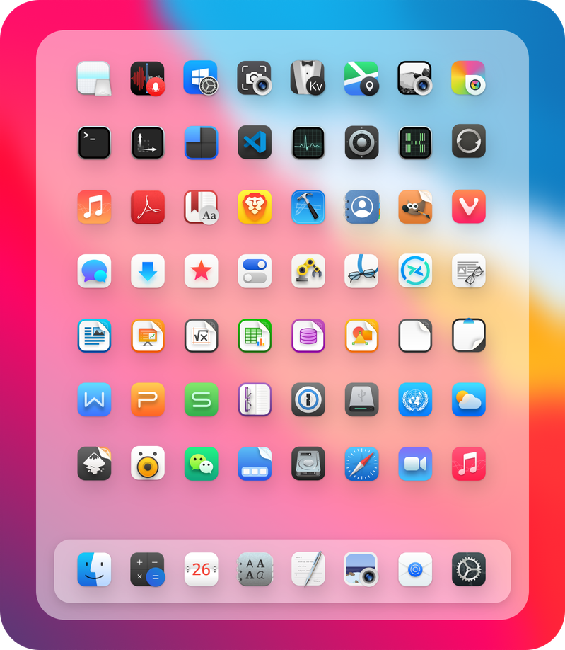
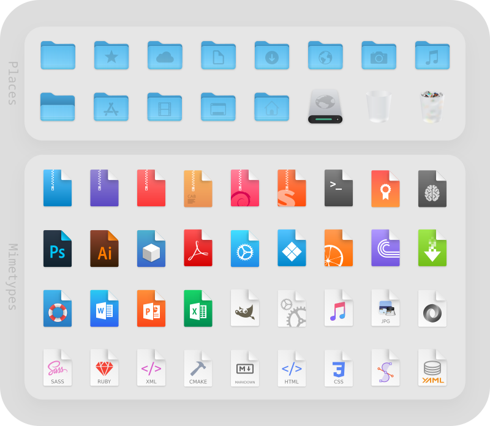

 WhiteSur Icon Theme
======

MacOS Big Sur like icon theme for linux desktops

## Install tips

Usage:  `./install.sh`  **[OPTIONS...]**

|  OPTIONS:           | |
|:--------------------|:-------------|
|-d, --dest           | Specify theme destination directory (Default: $HOME/.themes)|
|-n, --name           | Specify theme name (Default: WhiteSur)|
|-t, --theme          | Specify theme color variant(s) [default/purple/pink/red/orange/yellow/green/grey/all] (Default: blue)|
|-a, --alternative    | Install alternative icons (redesigned MacOS default icons)|
|-b, --bold           | Install bold panel icons version|
|--black              | Black panel icons version|
|-r,--remove,-u,--uninstall | Uninstall (remove) icon themes|
|-h, --help           | Show this help|

> **Note for snaps:** To use these icons with snaps, the best way is to make a copy of the application's .desktop located in `/var/lib/snapd/desktop/applications/name-of-the-snap-application.desktop` into `$HOME/.local/share/applications/`. Then use any text editor and change the "Icon=" to "Icon=name-of-the-icon.svg"

**Note for flatpaks:** To use these icons, change icon names inside `/var/lib/flatpak/exports/share` .desktop file.

> For more information, run: `./install.sh --help`


> Bold version suggested use in `High resolution display` like 4k display with 200% scale!

### New Icons

To be able to change some icons :

1. create a new one, ideally in svg format
2. store it in place of : <*WhiteSur-icon-theme*>/src/apps/scalable/<*name_of_app*>
3. reinstall icon theme, *for example* :

```bash
sudo ./install.sh -a -b
```

##### AppImages

To apply **icons** for the AppImages :

1. create a new icon if it does not exists already, ideally in svg format
2. right click on the AppImage file
3. click on the icon on the top left corner
4. select the icon you want to have

To have the icon and the app in the launcher / taskbar and so on ... :

1. create a new icon if it does not exists already, ideally in svg format
2. create a .desktop file in : /home/lmunier/.local/share/applications/ folder with the following specifications *as example, for SuperSlicer* :

```bash
[Desktop Entry]
Encoding=UTF-8
Type=Application
Categories=Slicer;
Name=SuperSlicer
Comment=3D printing slicer.
Exec=<path_to_your_appimage>
Icon=/usr/share/icons/WhiteSur-dark/apps/scalable/super-slicer.svg
StartupNotify=false
Terminal=false
Hidden=false
StartupWMClass=SuperSlicer
```

3. StartupWMClass specification allows the OS to have the right icon when the program is running. If you do not know what to put :
   1. open the program
   2. do : Alt + F2
   3. run command : lg
   4. click on *"Windows"* tab
   5. check the *"WMClass"* name and set it for *"StartupWMClass"*

## Requirement
You can use this with:

### GTK theme

WhiteSur-gtk-theme: https://github.com/vinceliuice/WhiteSur-gtk-theme

### KDE theme

WhiteSur-kde: https://github.com/vinceliuice/WhiteSur-kde

## Preview


